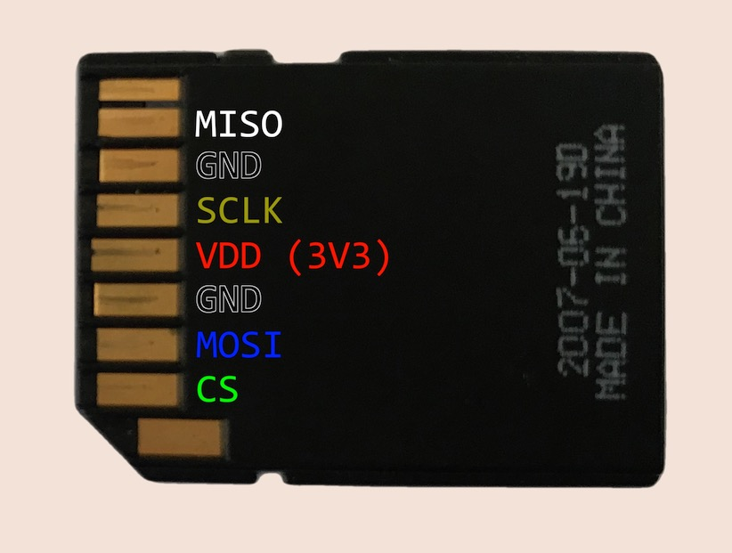

# ESP32 SDCard Wave File Example

This code shows how to record a WAV file to an SD Card attached to an ESP32 and then play it back.

There's an explanatory video [here](https://youtu.be/bVru6M862HY)

[](https://www.youtube.com/watch?v=bVru6M862HY)

There are two projects - one using Arduino and one using the Esspresif IDF. Both of these projects use PlatformIO to build.

Edit `config.h` for your device. In particular, you will probably want to change the button that is used to trigger recording and playback.

```
// record button
#define GPIO_BUTTON GPIO_NUM_23
```

# Do I need Pull-Up resistors

A few people have reported that they have only been able to get this to work by adding pull up resistors.

This is [recommended by Espressif](https://docs.espressif.com/projects/esp-idf/en/latest/esp32/api-reference/peripherals/sd_pullup_requirements.html) under some circumstances

So if you are having issues with your SD Card not initialising then I'd suggest trying to add 10K pull resistors to the lines to see if that fixes your issues.

# Wiring

Wiring up should be reasonably straightforward. The pins on an SD Card are as follows:



# Usage

To record audio press and hold the button. Recording will stop when you release the button.

The SD Card should contain a file called `test.wav` after a successful recording.

To playback the recording push the button.

Once the playback has finished the device will switch back to waiting for a new recording to be made.

# Arduino

The `arduino-wav-sdcard` folder has code that works on the current release of Arduino for the ESP32.

# IDF

The `idf-wav-sdcard` folder has code that works with the latest IDF release.
